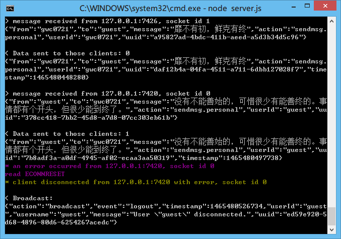
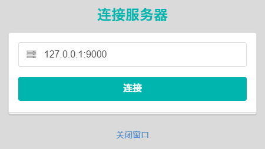
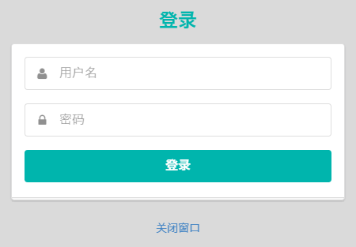
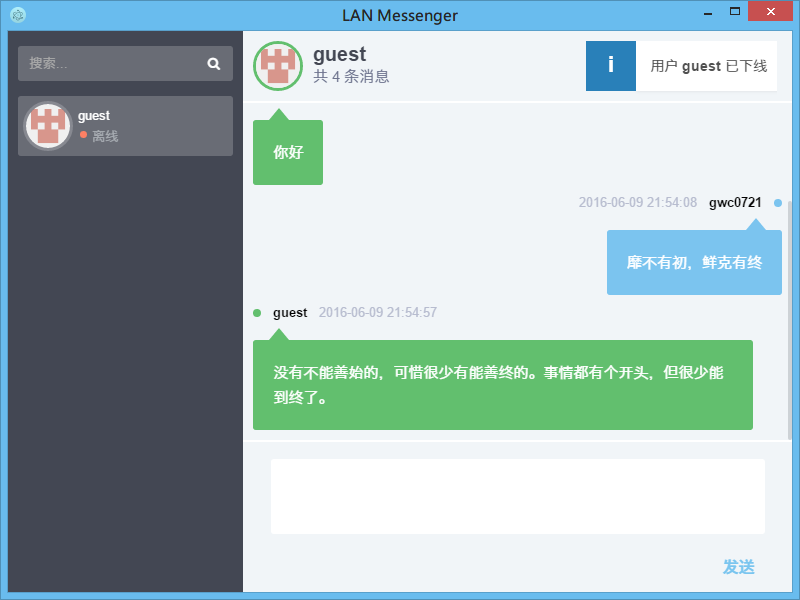

LAN Messenger
============================
A toy for learning "socket" using Node.js and Electron.  

# Install Dependencies
```
npm install -g bower
npm install
bower install
```
> ### FOR CHINESE USERS
> It's recommended to configure your npm's proxy setting.
> For example, save the following text as `.npmrc`:
> ```
proxy=http://127.0.0.1:1080
https-proxy=http://127.0.0.1:1080
```

# Run
## Server
```
npm start server
```
OR
```
node server.js
```

## Client
[electron-prebuilt](https://npmjs.org/package/electron-prebuilt) is an `npm` module that contains pre-compiled versions of Electron.  
If you've installed it globally with npm, then you will only need to run:
```
electron .
```

Or you should run the following commands to start the client:
### Windows
```
.\node_modules\.bin\electron .
```
### Linux and OS X
```
./node_modules/.bin/electron .
```

# Thanks
- Main UI Design: [Appon Chat Widget](https://dribbble.com/shots/1818748-Appon-Chat-Widget) by [Olia Gozha](https://dribbble.com/OliaGozha)
- Main UI's code is modified from: [5 Живой чат / Live chat](http://codepen.io/retyui/details/zxGqPJ)
- The notification widget is taken from [ZeroNet](https://github.com/HelloZeroNet/ZeroNet)

# Snapshots
  
  
  

